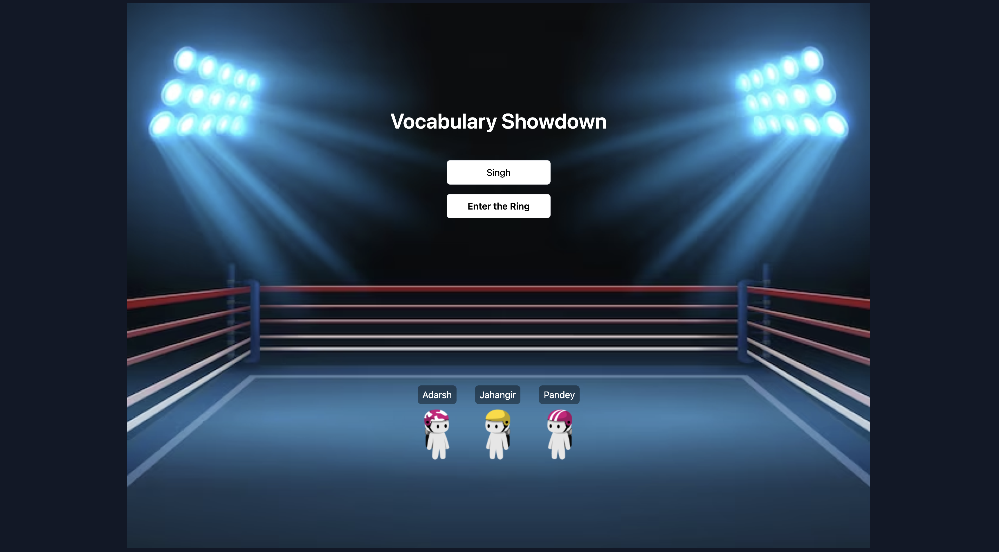

# vocab-showdown



Showdown is a PvP mode that focuses on friendly competition amongst students in a class and is designed to ensure that every student starts off on an even footing as possible and competes with others at their skill-level.

Each game is divided into multiple short rounds. An opponent is selected for every student to compete with at the start of every round. The selection algorithm ensures that the top students battle other top students and the weaker students battle weaker students.

Additionally, before the start of every round, students have 15 seconds to revise the questions that are going to be coming up.

## The two core insights that informed the design of this game-mode

We improve the most when we compete with people in/around our skill level : If the person we are competing against is a lot better than us, it is demoralizing. If the person we are competing against is a lot worse, it isn’t challenging and we don’t learn much. It is perfect when we are competing against someone who we know we can win against. Showdown is a 1v1 mode. An opponent is picked for you every round and based on whether you lose/win, another suitable opponent is picked. Such that the winners compete against other winners and losers against other losers.

Being tested on knowledge you don’t know sucks. Quizizz is often used as a review tool. But if you are a student who hasn’t really paid much attention during class, what point is a review? Showdown has a quick 30 second ‘revision’ time before every round where a student can quickly revise key concepts that they are going to be tested upon. The hope is that since they know they are going to be tested on it, 30 seconds from now, they will pay attention and try their hardest.

## How to run this project locally

```sh
git clone https://github.com/adarshrao/vocab-showdown/
cd vocab-showdown
npm install
npm run dev
```
